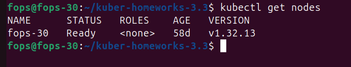
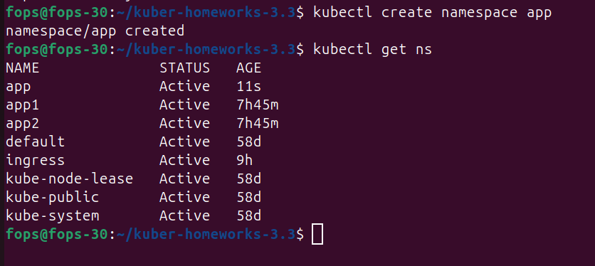
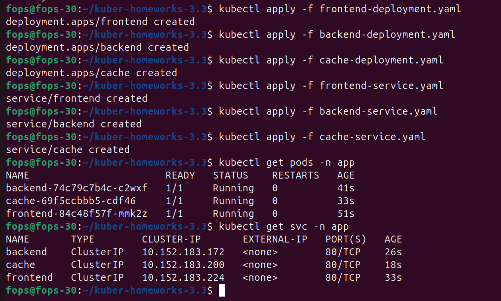
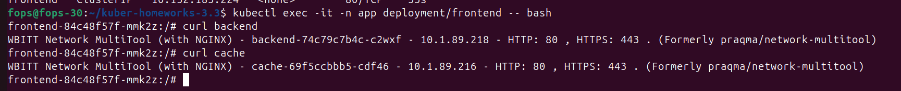
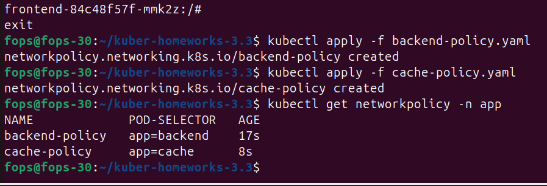
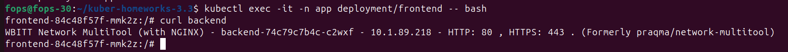
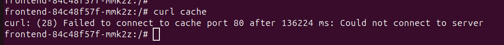
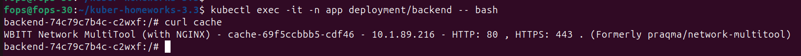

# Домашнее задание: «Как работает сеть в Kubernetes»

## Цель
Настроить сетевые политики (NetworkPolicy) так, чтобы разрешить только следующий доступ между приложениями:

frontend → backend → cache

Любые другие соединения должны быть запрещены.

---

# 1. Подготовка

Проверим, что кластер работает.

```bash
kubectl get nodes
```

Скриншот:



---

# 2. Создание namespace

Все поды должны находиться в namespace **app**.

```bash
kubectl create namespace app
```

Проверка:

```bash
kubectl get ns
```

Скриншот:



---

# 3. Создание Deployment

Используем образ **wbitt/network-multitool**.

## frontend deployment

```yaml
apiVersion: apps/v1
kind: Deployment
metadata:
  name: frontend
  namespace: app
spec:
  replicas: 1
  selector:
    matchLabels:
      app: frontend
  template:
    metadata:
      labels:
        app: frontend
    spec:
      containers:
      - name: multitool
        image: wbitt/network-multitool
        ports:
        - containerPort: 80
```

---

## backend deployment

```yaml
apiVersion: apps/v1
kind: Deployment
metadata:
  name: backend
  namespace: app
spec:
  replicas: 1
  selector:
    matchLabels:
      app: backend
  template:
    metadata:
      labels:
        app: backend
    spec:
      containers:
      - name: multitool
        image: wbitt/network-multitool
        ports:
        - containerPort: 80
```

---

## cache deployment

```yaml
apiVersion: apps/v1
kind: Deployment
metadata:
  name: cache
  namespace: app
spec:
  replicas: 1
  selector:
    matchLabels:
      app: cache
  template:
    metadata:
      labels:
        app: cache
    spec:
      containers:
      - name: multitool
        image: wbitt/network-multitool
        ports:
        - containerPort: 80
```

---

# 4. Создание сервисов

## frontend service

```yaml
apiVersion: v1
kind: Service
metadata:
  name: frontend
  namespace: app
spec:
  selector:
    app: frontend
  ports:
  - port: 80
    targetPort: 80
```

---

## backend service

```yaml
apiVersion: v1
kind: Service
metadata:
  name: backend
  namespace: app
spec:
  selector:
    app: backend
  ports:
  - port: 80
    targetPort: 80
```

---

## cache service

```yaml
apiVersion: v1
kind: Service
metadata:
  name: cache
  namespace: app
spec:
  selector:
    app: cache
  ports:
  - port: 80
    targetPort: 80
```

---

# 5. Применение манифестов

```bash
kubectl apply -f frontend-deployment.yaml
kubectl apply -f backend-deployment.yaml
kubectl apply -f cache-deployment.yaml

kubectl apply -f frontend-service.yaml
kubectl apply -f backend-service.yaml
kubectl apply -f cache-service.yaml
```

Проверка:

```bash
kubectl get pods -n app
kubectl get svc -n app
```

Скриншот:



---

# 6. Проверка соединений без политики

Подключимся к frontend:

```bash
kubectl exec -it -n app deployment/frontend -- bash
```

Проверим доступ к backend:

```bash
curl backend
```

Проверим доступ к cache:

```bash
curl cache
```

Скриншот:



---

# 7. Создание NetworkPolicy

Разрешаем:

frontend → backend

backend → cache

---

## политика backend

```yaml
apiVersion: networking.k8s.io/v1
kind: NetworkPolicy
metadata:
  name: backend-policy
  namespace: app
spec:
  podSelector:
    matchLabels:
      app: backend
  policyTypes:
  - Ingress
  ingress:
  - from:
    - podSelector:
        matchLabels:
          app: frontend
```

---

## политика cache

```yaml
apiVersion: networking.k8s.io/v1
kind: NetworkPolicy
metadata:
  name: cache-policy
  namespace: app
spec:
  podSelector:
    matchLabels:
      app: cache
  policyTypes:
  - Ingress
  ingress:
  - from:
    - podSelector:
        matchLabels:
          app: backend
```

---

# 8. Применение политики

```bash
kubectl apply -f backend-policy.yaml
kubectl apply -f cache-policy.yaml
```

Проверка:

```bash
kubectl get networkpolicy -n app
```

Скриншот:



---

# 9. Проверка доступа

Подключаемся к frontend:

```bash
kubectl exec -it -n app deployment/frontend -- bash
```

Разрешено:

```bash
curl backend
```

Скриншот:



---

Запрещено:

```bash
curl cache
```

Скриншот:



---

Подключаемся к backend:

```bash
kubectl exec -it -n app deployment/backend -- bash
```

Разрешено:

```bash
curl cache
```

Скриншот:



---

## Дополнительная диаграмма
В репозитории также добавлена схема DNS-компонентов кластера:
- `diagrams/coredns.puml`

Эта диаграмма иллюстрирует взаимодействие `CoreDNS`, `NodeLocalDNS`, `dns-autoscaler` и приложений внутри кластера.

---

# Итог

Были созданы:

- namespace app
- deployments frontend, backend, cache
- сервисы для приложений
- сетевые политики NetworkPolicy


Сетевая модель работает следующим образом:

frontend → backend → cache

Любые другие соединения запрещены.

